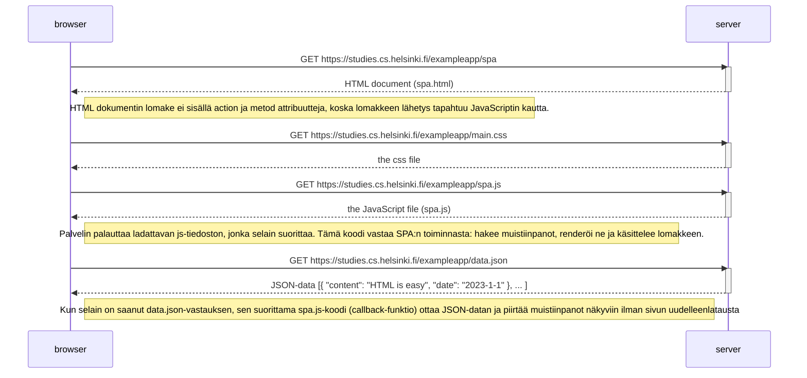

```mermaid
sequenceDiagram
    participant browser
    participant server
    
    browser->>server: GET https://studies.cs.helsinki.fi/exampleapp/spa
    activate server
    server-->>browser: HTML document (spa.html)
    deactivate server	

    Note right of browser: HTML dokumentin lomake ei sisällä action ja metod attribuutteja, koska lomakkeen lähetys tapahtuu JavaScriptin kautta.

    browser->>server: GET https://studies.cs.helsinki.fi/exampleapp/main.css
    activate server
    server-->>browser: the css file
    deactivate server

    
    browser->>server: GET https://studies.cs.helsinki.fi/exampleapp/spa.js
    activate server
    server-->>browser: the JavaScript file (spa.js)
    deactivate server

    Note right of browser: Palvelin palauttaa ladattavan js-tiedoston, jonka selain suorittaa. Tämä koodi vastaa SPA:n toiminnasta: hakee muistiinpanot, renderöi ne ja käsittelee lomakkeen.

    browser->>server: GET https://studies.cs.helsinki.fi/exampleapp/data.json
    activate server
    server-->>browser: JSON-data [{ "content": "HTML is easy", "date": "2023-1-1" }, ... ]
    deactivate server    

    Note right of browser: Kun selain on saanut data.json-vastauksen, sen suorittama spa.js-koodi (callback-funktio) ottaa JSON-datan ja piirtää muistiinpanot näkyviin ilman sivun uudelleenlatausta 
   
```
